# Best Video Generation Models as of May 2026

## Executive summary

As of **May 31, 2026**, the frontier in video generation is split across three camps. **Google Veo 3.1** is the strongest all-around choice for teams that want top-tier realism, native audio, enterprise APIs, and a clear pricing/controls story. **Kling VIDEO 3.0 Omni** is the best fully active prosumer-to-pro narrative system for longer, multimodal, multi-shot generation with strong consistency controls. **Runway Gen-4.5** remains the most mature creator workflow for controllable generation inside a polished editing ecosystem. On the open side, **LTX-2.3** is the best current open-weights/local-first audiovisual family, while **Wan 2.1 VACE** is the most useful open-source platform for serious video editing and research workflows. Meanwhile, **Seedance 2.0** has arguably the strongest raw public human-preference momentum among newly released models, but its rollout, documentation maturity, and legal posture are less settled than Google/Runway’s. citeturn27search4turn27search7turn38search2turn39view0turn10view2turn7search0turn30view0turn35search2turn35search8

The most important caveat is that **benchmark results are not directly commensurate**. Human-preference leaderboards such as Arena/Artificial Analysis reward short-clip perceptual quality and prompt satisfaction, while **VBench** and **VBench-2.0** decompose different aspects of visual and “intrinsic faithfulness,” and **VABench** evaluates synchronized audio-video. As a result, a model can lead one benchmark and still be a worse production choice for editing, cost, or deployment. citeturn44search0turn44search1turn44search2turn44search3turn44search7turn8search0turn8search2

My bottom-line recommendations are straightforward. If you want the best single default recommendation, choose **Veo 3.1**. If you care most about **longer, cinematic, multi-shot stories and tight character/product consistency**, choose **Kling VIDEO 3.0 Omni**. If you want the most practical **creator workflow and editing ecosystem**, choose **Runway Gen-4.5**. If you want **open weights and local deployment**, choose **LTX-2.3** for audiovisual generation and **Wan 2.1 VACE** for open video editing and experimentation. If you have access to it and can tolerate platform/legal uncertainty, **Seedance 2.0** is one of the most important models to watch. citeturn39view0turn39view1turn18search10turn10view0turn11view3turn35search1turn37search5turn30view0turn30view2turn7search0turn6search5turn27search4

## Scope and evaluation method

This report prioritizes, in order, **official release pages and provider documentation**, **recent papers and arXiv preprints**, and then **benchmark sources with transparent methodology**. For visual/video-only evaluation I rely most on **VBench** and **VBench-2.0** for decomposed quality and “intrinsic faithfulness,” plus **Arena / Artificial Analysis** for current blind human-preference rankings. For synchronized audio-video claims, I also rely on **VABench**, which was introduced specifically because older video benchmarks did not adequately capture audiovisual alignment. citeturn44search0turn44search1turn44search2turn44search3turn44search7turn8search0turn8search2

Two methodological constraints matter. First, many closed providers **do not publicly disclose** training-set scale, FLOPs, exact GPU topology, or stable latency numbers. Where primary materials did not publish those fields, I mark them as **undisclosed** rather than guessing. Second, for several fast-moving Chinese frontier models that rank extremely well in public arenas, I could not assemble the same quality of globally accessible primary documentation on deployment, pricing, or governance as I could for Google, Runway, LTX, Wan, and OpenAI. That is why some impressive models appear in discussion but not in the ranked shortlist. citeturn39view0turn10view2turn17search1turn7search0turn30view0turn42view1

## Recent release timeline

The market moved unusually fast from 2024 through May 2026. The key pattern is a migration from short silent clips toward **native audio**, **editing-aware workflows**, **reference-asset consistency**, and, increasingly, **longer multi-shot generation**. citeturn42view0turn24search1turn33search2turn30view2turn38search8turn42view0turn39view0turn10view2turn36search0turn6search5turn38search2

```mermaid
flowchart LR
    A["Feb 2024<br/>OpenAI Sora original"] --> B["Jan 2025<br/>Luma Ray2"]
    B --> C["Jan 2025<br/>Alibaba Wanx 2.1 announced"]
    C --> D["Feb 2025<br/>Wan 2.1 open-sourced"]
    D --> E["May 2025<br/>Wan 2.1 VACE"]
    E --> F["May-Jun 2025<br/>Google Veo 3 unveiled / public preview"]
    F --> G["Sep 2025<br/>OpenAI Sora 2"]
    G --> H["Nov 2025<br/>Google Veo 3.1 GA"]
    H --> I["Dec 2025<br/>Runway Gen-4.5"]
    I --> J["Jan 2026<br/>LTX-2"]
    J --> K["Feb 2026<br/>Seedance 2.0 official release in China"]
    K --> L["Apr 2026<br/>Veo 3.1 Lite"]
```

The dates in the timeline above come from official release or documentation pages from OpenAI, Luma, Alibaba, Google, Runway, and LTX, plus the Seedance 2.0 paper and CapCut rollout notice. citeturn42view0turn24search1turn33search2turn29news30turn30view2turn38search8turn39view0turn10view2turn36search0turn7search0turn6search5turn38search2

## Ranked shortlist and comparison

### Ranked shortlist

| Rank | Model | Why it makes the shortlist | Main tradeoff |
|---|---|---|---|
| 1 | **Google Veo 3.1** | Best overall balance of realism, native audio, enterprise readiness, multimodal controls, and official pricing/API maturity | Closed; short base clip lengths; core architecture details undisclosed | 
| 2 | **Kling VIDEO 3.0 Omni** | Best active platform for multimodal, multi-shot, 15-second narrative generation with strong consistency and native audio | Less transparent than Google/Runway on training/governance; globally uneven access | 
| 3 | **Runway Gen-4.5** | Best polished creator workflow and one of the strongest controllable generation systems in production use | Current Gen-4.5 docs emphasize 720p output and no native-audio claim on the core model page | 
| 4 | **Seedance 2.0** | Public blind-vote momentum is extremely strong; native multimodal audio-video generation with unusually broad reference/edit support | Global rollout/legal posture less settled; publicly accessible product docs are newer and uneven | 
| 5 | **LTX-2.3** | Best open-weights/local-first audiovisual option; strongest open family on current blind-vote leaderboards | Quality still trails the best proprietary models | 
| 6 | **Wan 2.1 VACE** | Best open-source editing/research platform, with unusually broad all-in-one creation and editing support | Out-of-the-box quality and speed lag top proprietary models; self-hosting burden is real | 

The ranking above weights **real output quality**, **controllability**, **availability**, **API/deployment maturity**, **cost clarity**, and **governance clarity**, not just leaderboard position. That is why a model like Seedance 2.0, despite leading current public arenas, ranks below Veo 3.1 and Kling 3.0 Omni in the final production-oriented ordering. citeturn27search4turn27search7turn39view0turn39view1turn10view2turn7search0turn35search2turn30view2

### Key attribute comparison

| Model | Provider | Release status by May 2026 | Inputs | Outputs | Max base duration | Highest documented resolution | Representative cost | Open-source status | Primary sources |
|---|---|---|---|---|---:|---|---|---|---|
| **Veo 3.1** | Google | GA since Nov 17, 2025; Lite added Apr 3, 2026 | Text, image | Video, audio | 4/6/8s | 4K | 1080p audio: **$0.40/s = $24/min**; 1080p no-audio: **$0.20/s = $12/min** | No | citeturn39view0turn39view1turn5view4turn38search2 |
| **Kling VIDEO 3.0 Omni** | Kuaishou / Kling AI | Fully rolled out by early 2026 | Text, image, video, audio | Video, audio | 15s | 4K | 1080p + native audio: **12 credits/s ≈ $10.9/min** at $1 = 66 credits | No | citeturn17search6turn17search5turn18search8turn18search10turn18search18 |
| **Runway Gen-4.5** | Runway | Released Dec 1, 2025 | Text, image | Video | 2–10s | 720p in current Gen-4.5 docs | **12 credits/s = $0.12/s = $7.2/min** | No | citeturn10view2turn10view0turn10view1 |
| **Seedance 2.0** | ByteDance / Dreamina / CapCut | Officially released in China early Feb 2026; CapCut rollout began Apr 9, 2026 | Text, image, audio, video | Video, audio | 4–15s | 720p native in paper; 1080p available via third-party integrations | On Runway API: **$0.36–0.40/s = $21.6–24/min** | No | citeturn7search0turn6search5turn10view1 |
| **LTX-2.3** | Lightricks / LTX | Released Mar 2026; open local stack active by May 2026 | Text, image, audio, video workflows | Video, audio | ~20s for A2V per request | 1080p cited for API fast tier; 4K capability claimed for the family | Fast T2V/I2V 1080p: **$0.06/s = $3.6/min**; local open-weights use has no usage fee | Open weights with custom LTX license | citeturn35search1turn37search8turn37search11turn37search1turn35search6 |
| **Wan 2.1 VACE** | Alibaba / Wan | Open-sourced May 15, 2025 | Text, image, video, masks | Video | task-dependent; core short-video generation | 720p in released VACE open models; Wan-VAE supports 1080p encoding/decoding | Self-hosted; no fixed official cloud price in primary sources reviewed | Yes, Apache 2.0 | citeturn30view2turn30view0turn30view1turn31view4 |

Two important omissions deserve explicit mention. **OpenAI Sora 2 Pro** remains technically strong, especially for extensions and high-resolution 1080p exports, but the **Sora web/app experience was discontinued on April 26, 2026, and the API is scheduled for discontinuation on September 24, 2026**, which makes it a poor recommendation for new production builds despite strong capabilities. Public Arena leaderboards also place models such as **HappyHorse-1.0**, **Wan2.7**, and **grok-imagine-video** extremely high as of May 29, 2026, but I did not shortlist them because I could not assemble equally rigorous primary-source coverage across architecture, pricing, deployment, and governance. citeturn42view4turn42view1turn42view2turn43view2turn27search4turn27search2

## Model profiles

### Google Veo 3.1

**Provider and release.** Veo 3.1 is Google’s latest documented Veo line, with the GA `veo-3.1-generate-001` model released on **November 17, 2025** and **Veo 3.1 Lite** added on **April 3, 2026**. It is available through Google’s video generation API, Media Studio, Vertex AI / Agent Platform, and Google AI Studio pathways. citeturn39view0turn38search2turn4view0

**Modalities, formats, control, and cost.** Veo 3.1 supports **text-to-video** and **image-to-video**, with video outputs at **720p, 1080p, and 4K**, in **16:9** or **9:16**, at **24 FPS**, for **4, 6, or 8 second** clips. Google’s overview also states that Veo can generate **audio and dialogue**, extend videos, and use first/last frames. The product docs list support for prompt rewriting, asset-image references, extensions, first/last-frame generation, and C2PA Content Credentials. Pricing is unusually transparent by frontier-video standards: for Veo 3.1, **1080p video+audio is $0.40/s**, **1080p no-audio is $0.20/s**; Lite and Fast tiers reduce price materially. citeturn39view0turn39view1turn40view2turn40view4turn5view4

**Compute, quality, governance, and weaknesses.** Google does not publish FLOPs or detailed GPU latency in the primary docs reviewed, but it does expose a full tiered product family and quotas, and it explicitly positions the lineup as balancing quality, speed, and cost. Governance is stronger than most competitors: Google states generated videos include **SynthID** watermarking, and product docs include **Content Credentials (C2PA)** support. Its biggest weakness is not raw quality; it is that all currently documented base generations are still **short clips**, so long-form work must be composed through extension or downstream editing. citeturn4view0turn39view0turn40view4turn38search5

### Kling VIDEO 3.0 Omni

**Provider and release.** Kling AI’s current flagship family by May 2026 is the **Kling 3.0 series**, with official release-note snippets describing the 3.0 model as fully rolled out and adding native 4K, multimodal reference capabilities, and Omni workflows. citeturn17search6turn17search2turn18search16

**Modalities, formats, control, and cost.** Kling 3.0 Omni is materially different from earlier generations because it combines **text, image, video, and audio** into a single workflow, supports **15-second** clips, and offers **1080p** and **4K** modes. The official snippets describe AI Director multi-shot control, **Character Identity / Elements**-style reference binding, native audio, and multilingual lip-sync or dialogue workflows. Pricing is credit based. Kling’s public credit policy says **$1 = 66 credits**; official Kling blog/docs snippets describe **1080p with native audio at 12 credits/s**, **720p with native audio at 9 credits/s**, and **1080p without audio at 8 credits/s**. That puts 1080p audiovisual generation at roughly **$10.9/min** by straight conversion. citeturn17search5turn18search10turn18search18turn18search8turn17search7

**Strengths and weaknesses.** Kling 3.0 Omni is the best currently active option for **longer, structured, multi-shot narrative generation** in a single vendor surface. It is especially strong when subjects, products, or narrators must remain visually and vocally stable across scenes. Its tradeoff is weaker transparency. Publicly accessible official materials are rich on features, but they are much thinner than Google’s on training data, evaluation methodology, and governance documentation. For enterprise deployments, that transparency gap matters. citeturn18search10turn18search12turn17search13

### Runway Gen-4.5

**Provider and release.** Runway released **Gen-4.5** on **December 1, 2025**, calling it its best-in-class AI video model and explicitly stating it was built on **NVIDIA Hopper and Blackwell GPUs**. citeturn10view2

**Modalities, formats, control, and cost.** The current Gen-4.5 creation docs describe **text-to-video** and **image-to-video** controls, **2–10 second** durations, multiple aspect ratios, and **720p** output at **24 or 25 FPS**. Runway’s API pricing page prices Gen-4.5 at **12 credits/s**, and the API docs define credits as **$0.01 each**, giving an effective rate of **$0.12/s** or **$7.20/min**. Runway’s wider ecosystem matters almost as much as the base model: its research release says Gen-4.5 will inherit controls such as **Image-to-Video, Keyframes, Video-to-Video**, and more, while Runway’s product lineup also includes tools such as **Aleph** for edit video and **Act-Two** for performance capture. citeturn10view0turn10view1turn11view1turn9search11turn9search5

**Quality, constraints, and failure modes.** Runway’s own release cites **1,247 Elo** on Artificial Analysis as of November 30, 2025, and argues Gen-4.5 materially improved motion, prompt adherence, temporal consistency, and controllability. More valuable than the marketing claim is that Runway explicitly documents key failure modes: **causal reasoning errors**, **object permanence failures**, and **success bias**. That honesty makes it easier to use in production. The main limitation is that, in the public Gen-4.5 creation docs reviewed here, the model is still framed around **720p** outputs and short shot lengths, so it is often best used as part of a broader editorial pipeline rather than as an end-to-end long-form generator. citeturn10view2turn11view3

### Seedance 2.0

**Provider and release.** Seedance 2.0 is a ByteDance / Dreamina / CapCut model family. Its paper states it was **officially released in China in early February 2026**, and CapCut announced rollout of Dreamina Seedance 2.0 in its platform on **April 9, 2026**. citeturn7search0turn6search5

**Modalities, formats, control, and quality position.** The Seedance 2.0 paper is especially notable because it positions the model as a **native multimodal audio-video generation system** supporting **text, image, audio, and video** inputs, with **4–15 second** output duration and native **480p and 720p** outputs. It also claims one of the most comprehensive suites of multimodal reference and editing capabilities in the industry. In current public human-preference evaluation, Seedance 2.0 is exceptionally strong: Arena’s **May 29, 2026** text-to-video leaderboard ranks **dreamina-seedance-2.0-720p** first overall, ahead of widely discussed Western and Chinese competitors. citeturn7search0turn27search4

**Cost, availability, and risk.** Globally accessible first-party pricing is not as clearly published as Google or Runway’s, but Runway’s third-party API integration prices `seedance2` at **36 credits/s** for **480p/720p** and **40 credits/s** for **1080p**, equivalent to roughly **$21.6–24/min** on Runway’s API. The bigger issue is not cost; it is governance and availability. Reuters and AP reported significant **copyright and likeness disputes** around the model’s launch and said the global launch had been affected, which raises real due-diligence concerns for commercial users even though the raw model quality appears excellent. citeturn10view1turn7news19turn7news21

### LTX-2.3

**Provider and release.** LTX-2.3 is the current flagship open-weights family from Lightricks/LTX by May 2026. The Hugging Face model card describes it as a significant update to LTX-2, and LTX positions it as the latest model in the product stack; LTX Desktop runs locally on the LTX-2.3 engine. citeturn35search1turn35search3turn35search6

**Architecture, modalities, deployment, and cost.** LTX-2, the direct predecessor family, is documented in arXiv as an **efficient joint audio-visual foundation model** using an **asymmetric dual-stream transformer** with a **14B video stream** and **5B audio stream**. LTX-2.3 extends that line with stronger audio, visuals, prompt adherence, and portrait support. LTX’s API lists **1080p Fast text-to-video and image-to-video at $0.06/s**, while its **audio-to-video** API lists **1080p at $0.10/s** and up to roughly **20 seconds** per request. The local story is what makes LTX strategically important: LTX Desktop is open-source beta, runs on your machine on supported NVIDIA GPUs, and the model download is about **42 GB bf16** or **20 GB FP8** according to the setup guide. citeturn36search0turn35search1turn37search8turn37search11turn37search16turn35search6

**License and quality position.** LTX does not use a standard permissive OSI-style arrangement; it uses the **LTX Model Dev License**, and LTX says a separate commercial license is needed only for companies above **$10M annual revenue** using it in a revenue-driving production product. That makes it much more open than Veo/Runway/Kling, but not legally identical to Apache 2.0. On blind-vote benchmarks, LTX-2.3 Fast and Pro lead the **open-weights with-audio** tier in Artificial Analysis, but they still sit below the best proprietary frontier models overall. That makes LTX the best recommendation for **local, interactive, developer-first** workflows, not the absolute best raw-quality model. citeturn37search1turn35search2turn35search8

### Wan 2.1 VACE

**Provider and release.** Alibaba’s **Wan 2.1** is one of the most important open video model families of 2025–2026, and **Wan 2.1 VACE** was officially unveiled on **May 15, 2025** as an all-in-one creation and editing model. citeturn30view2turn29search0

**Architecture, scope, compute, and integration.** Wan’s technical report describes the family as built on the **diffusion transformer paradigm** with a novel video VAE and scalable pre-training. The paper says the **14B** model was trained on a dataset comprising **billions of images and videos**, while the GitHub repo emphasizes that the **1.3B T2V model needs only 8.19 GB VRAM** and can generate a **5-second 480p** clip on an **RTX 4090 in about 4 minutes** without extra optimization. The GitHub and Alibaba materials also show why Wan remains strategically useful even when it is not the quality leader: it has official integration paths into **Hugging Face, ModelScope, Diffusers, ComfyUI, and Gradio**, and VACE unifies text/image/video/mask conditioning for tasks including video repainting, masked editing, trajectory control, reference-based swaps, and spatial-temporal extension. citeturn30view1turn30view0turn30view2

**Benchmark position, licensing, and constraints.** Alibaba publicly claimed two different VBench totals for Wan/Wanx 2.1: **84.7** in a January 2025 announcement and **86.22** in a February 2025 open-source announcement, both while stating it led VBench. The discrepancy is a good example of why single vendor benchmark numbers should be treated as **snapshot- and configuration-dependent**. The positive side is licensing clarity: the GitHub repository states the released models are under **Apache 2.0**. The limitations are equally clear in the official docs: the 1.3B model is best at **480p**, its **720p outputs are less stable**, and some tasks such as first-last-frame generation were trained primarily on Chinese text-video pairs. citeturn33search2turn34search0turn31view4turn31view0turn32view3

## Use-case recommendations

The “best” model changes materially by task, and the task framing matters more than the headline leaderboard. citeturn44search0turn44search1turn44search7turn8search0

| Use case | Best current recommendation | Why | Runner-up |
|---|---|---|---|
| **Short text-to-video clips** | **Veo 3.1** | Strongest overall mix of realism, native audio, prompt adherence, and official API readiness | Seedance 2.0 |
| **Long-form video generation** | **Kling VIDEO 3.0 Omni** | 15-second multi-shot generation plus reference/audio consistency makes it the best actively supported long-form building block | Sora 2 Pro, but only as a legacy option because of sunset |
| **Video editing and extension** | **Runway ecosystem** | Gen-4.5 + Aleph + Act-Two give the most mature practical edit pipeline | Wan 2.1 VACE for open/self-hosted work |
| **High-fidelity photorealistic output** | **Veo 3.1** | Google’s current model family is the safest top-end photorealism recommendation | Seedance 2.0 where accessible |
| **Animation / cartoon / stylized work** | **Seedance 2.0** | Official workflows and positioning emphasize cinematic and anime/style transforms, and its public human-preference strength is broad | Runway Gen-4.5 |
| **Real-time / interactive / local iteration** | **LTX-2.3 Fast** | Fast tier, local deployment, and open dev workflow make it best for interactive product loops | Wan 2.1 1.3B for low-cost experimentation |

The one category where an explicit caveat is unavoidable is **long-form**. OpenAI’s Sora 2 docs are the most explicit about extension mechanics, stating single extensions can add **up to 20 seconds** and can be chained **up to six times** for **120 seconds total**, but the product is already in the process of being discontinued. For a new project started in late May 2026, I would therefore still choose **Kling VIDEO 3.0 Omni** or an LTX/Wan composition pipeline over Sora unless you already depend on the OpenAI API and accept the retirement timeline. citeturn43view2turn42view4turn18search10

## Benchmark discrepancies and limitations

Benchmark disagreement is not noise; it is structural. **VBench** measures video generation across **16 decomposed dimensions** and validates alignment with human perception. **VBench-2.0** shifts toward deeper “intrinsic faithfulness,” covering **Human Fidelity, Controllability, Creativity, Physics, and Commonsense**. **VABench** was then introduced because even those benchmarks did not fully evaluate synchronized audio-video generation. Arena-style leaderboards, by contrast, use **blind human votes** and **Elo ratings** on direct pairwise comparisons. Those are all useful, but they are evaluating different things. citeturn44search0turn44search1turn44search3turn44search7turn8search0turn8search2

That is why, for example, **Seedance 2.0** can lead a current public human-preference leaderboard while **Veo 3.1** is still my best overall recommendation for many teams. Public taste tests reward what users visibly prefer in short side-by-side clips. Production buyers also care about API maturity, watermarking, rights posture, documentation quality, predictable pricing, and extension/edit tooling. Similarly, **Wan 2.1** can simultaneously be benchmark-strong and still not be the easiest production choice because self-hosting, latency, and editing ergonomics matter. citeturn27search4turn39view0turn4view0turn30view0turn30view2

A second discrepancy worth noting is that **vendor-published benchmark numbers can shift across announcements**. Alibaba cited **84.7** for Wanx 2.1 in January 2025 and **86.22** after open-sourcing in February 2025, while still describing the family as VBench-leading in both cases. The most plausible explanation is a mix of **different checkpoints, evaluation settings, or leaderboard snapshots**, which is common in fast-moving generative-video evaluation. citeturn33search2turn34search0

## Open questions and final judgment

Several fields the user asked for remain **incompletely disclosed across the market**, especially **FLOPs, exact GPU topology, training-set composition, and stable latency distributions** for closed systems such as Veo, Kling, Runway, and Seedance. In this report I have treated those as unknown where the primary materials reviewed did not publish them, because guessing would be less rigorous than leaving the field blank. citeturn39view0turn10view2turn17search1turn7search0

If I were making a deployment decision **today**, with no budget or license constraint, I would pick **Google Veo 3.1** as the default recommendation. If my workflow depended on structured **multi-shot storytelling and persistent characters/products**, I would choose **Kling VIDEO 3.0 Omni**. If I needed the best creator-facing surface for iterative video work inside a mature toolchain, I would choose **Runway Gen-4.5**. If I needed **open weights**, my first stop would be **LTX-2.3** for audiovisual/local work and **Wan 2.1 VACE** for editing-heavy self-hosted pipelines. And if I were scouting the model most likely to alter this ranking next, it would be **Seedance 2.0**, because its public preference numbers are already elite even though its production story is not yet as settled. citeturn39view0turn18search10turn10view2turn35search2turn30view2turn27search4