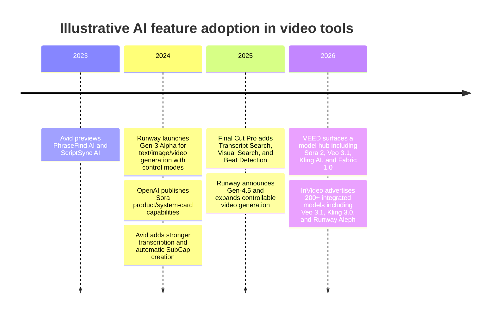

# Video Editing Software and App Space by Function

## Executive summary

The video-editing market is no longer well described by labels like “consumer,” “prosumer,” or “professional.” A more useful lens is **what functions each product actually performs**. On that basis, the space now breaks into a handful of functional stacks: classical track-based NLEs for deterministic editing and finishing; magnetic or simplified mobile editors for fast multi-layer short-form work; transcript- or storyboard-driven editors for spoken-word and repurposing workflows; template-heavy web suites for marketing and social publishing; generative video studios for shot creation and manipulation; and collaboration/media-management layers that sit beside the editor rather than replacing it. The most complete “craft” stacks remain Adobe Premiere Pro, Final Cut Pro, DaVinci Resolve, and Avid Media Composer, while the fastest social workflows cluster around CapCut, KineMaster, LumaFusion, Clipchamp, Canva, VEED, and WeVideo. Generative-first systems such as Runway, Pika, Synthesia, InVideo, Pictory, and historically Sora push farther into creation-from-prompt than classical NLEs do.

Three structural facts stand out. First, **core primitives have commoditized**: almost every active editor now supports trimming, splitting, merging, transitions, text overlays, and some version of stock media or templates. Second, **capability diverges sharply above that baseline**. Pro desktop tools still lead on high-end color, audio post, compositing depth, interchange, frame-accurate editorial control, codec breadth, and hardware acceleration, while browser and mobile tools lead on captioning, auto-reframing, social resizing, template speed, and one-click publishing. Third, **AI is now bifurcated** into two distinct layers: assistive AI inside editors for search, transcription, cleanup, reframing, and masking; and generative AI for net-new footage, avatars, voice, dubbing, or object-level video manipulation.

The highest-confidence strategic conclusion is that the most attractive product opportunity is **not** “another generic video editor” and probably **not** “a pure text-to-video toy.” The white space is a **collaboration-native, provenance-aware, AI-assisted assembly and localization layer** that preserves deterministic timeline controls while orchestrating multiple generation, cleanup, captioning, dubbing, and review services. Today, users can get world-class editing, or world-class generation, or world-class review/versioning—but rarely all three in one coherent workflow. That gap shows up clearly when comparing Resolve/Frame.io/Blackbird on coordination, Premiere/Final Cut/Avid on craft depth, and Runway/VEED/InVideo/Synthesia/Pika on AI creation breadth.

## Functional taxonomy and market map

A function-first taxonomy is more analytically useful than vendor positioning because many products market themselves as “all-in-one,” while in practice they specialize in different parts of the workflow.

| Function category | What it includes | Why it matters operationally | Representative leaders |
|---|---|---|---|
| Primitives | Ingest, trim, split, stitch/assemble, merge, ripple/roll/slip/slide, retime, resize, crop | Determines whether a tool can be the system of record for editorial decisions | Premiere Pro, Final Cut Pro, DaVinci Resolve, Avid, LumaFusion, CapCut |
| Enhancement | Transitions, filters, color correction/grading, LUTs, speech cleanup, EQ, ducking/noise reduction, stabilization | Separates “assembler” tools from tools that can produce publishable or broadcast-ready outputs | Resolve, Premiere Pro, Final Cut Pro, LumaFusion, KineMaster, VEED |
| Compositing | Multi-layer overlays, masks, keying, alpha, blend modes, object masking/tracking, motion graphics | Matters for ads, branded content, creators, explainers, and VFX-adjacent work | Resolve/Fusion, Premiere Pro, Final Cut Pro, LumaFusion, KineMaster, Filmora |
| Generative and AI | Transcription, auto-captions, scene/search intelligence, smart reframe, object removal, generative extend/fill, text-to-video, image-to-video, avatars, voice clone, lip-sync | Largest current source of product differentiation and workflow compression | Adobe Firefly in Premiere, DaVinci Neural Engine, Final Cut intelligence features, Runway, Pika, Synthesia, VEED model hub, InVideo multi-model platform |
| Collaboration and distribution | Shared projects, comments/review, versioning, cloud sync, media libraries, teamspaces, publishing, APIs | Determines fit for teams, agencies, broadcasters, and enterprise operations | Frame.io, Blackbird, Resolve/Blackmagic Cloud, CapCut Spaces, WeVideo, Pictory Teams, Synthesia |

Across official documentation, the **functional map of the market** looks like this: desktop NLEs dominate deterministic craft and finishing; mobile editors dominate social-native speed; text/story editors dominate spoken-word revision and clip extraction; web suites dominate templated marketing output; generative studios dominate shot invention and manipulation; and cloud workflow layers dominate review, versioning, and distributed production.

## Cross-sectional inventory

The tables below use grouped attributes to keep the comparison readable. When vendors did not explicitly specify a capability, codec, acceleration path, or versioning behavior in the sources reviewed, it is marked **unspecified**.

### Desktop editors

| App | Platforms, timeline, performance | Core editing, overlays, compositing | Audio, captions, export | Collaboration, assets, pricing, persona | AI mode | Sources |
|---|---|---|---|---|---|---|
| **Adobe Premiere Pro** | macOS/Windows; classical **track-based NLE**; Mercury Playback Engine is GPU-accelerated; Adobe documents hardware-accelerated decode/encode options. | Full editorial primitives; multi-layer video/image/text; object masking, mask tracking, blend modes, compositing; text-based editing and pause deletion. | Speech-to-Text, captions, translated captions; export/control breadth is broad but exact codec matrix was not fully enumerated in retrieved sources. | Adobe ecosystem collaboration and review workflows, including collaboration page and Frame.io-adjacent workflows; subscription; pro editors, agencies, post teams. | **Native** AI plus Adobe Firefly integration for **Generative Extend** and media intelligence. | [Adobe Premiere Pro][src-premiere-pro]; [Frame.io][src-frame-io] |
| **Final Cut Pro** | macOS; **magnetic timeline** with clip connections; optimized for Apple silicon. | Full editing primitives; multi-layer titles/effects; third-party FxPlug ecosystem; AI Magnetic Mask; Smart Conform; library/keyword/smart-collection asset model. | Multichannel audio editing in timeline, audio effects, background-noise reduction; Transcribe to Captions; exports audio stems and multiple deliverables via roles metadata; XML import/export. | Library-centric media management; one-time Mac App Store purchase; strong for independent pros, YouTubers, and Mac-centric post. | **Native** AI/ML features; model/provider **unspecified** in cited sources. | [Apple Final Cut Pro][src-final-cut-pro] |
| **DaVinci Resolve** | macOS/Windows/Linux; Cut + Edit pages, both fundamentally **track-based**; Resolve Studio supports multiple GPUs, accelerated H.264/H.265, up to 120fps at 32K. | Full NLE primitive set; Fusion for VFX/motion graphics; advanced color; subtitles/closed captioning; pro track layout on Edit page. | Fairlight supports up to **2,000 tracks** with realtime EQ/dynamics and AI voice tools such as Voice Isolation and Music Remixer. | Real-time local/remote collaboration via Blackmagic Cloud with clip/bin locking and multi-user timelines; free tier plus Studio at **$295** in retrieved official pricing; target editors, colorists, VFX, finishing teams. | **Native** DaVinci Neural Engine AI, including Magic Mask and search/intelligence features. | [Blackmagic DaVinci Resolve][src-resolve] |
| **Avid Media Composer** | macOS/Windows; classical **track-based** editorial system; performance specifics beyond standard pro positioning were largely **unspecified** in retrieved sources. | Full professional editorial primitives are implied by product positioning; deeper public-function detail in retrieved sources centered on transcript/search rather than effects. | Transcript tool and one-click **Create SubCap**; PhraseFind AI searches dialogue; ScriptSync AI speeds script-based editing. | Team-oriented professional editorial platform; standard and Ultimate pricing tiers are listed by Avid; target scripted TV, film, large-team editorial. Shared-storage specifics were not fully retrieved here. | **Native** assistive AI for transcript/search/script workflows. | [Avid Media Composer][src-avid] |
| **Wondershare Filmora** | Desktop and mobile; simplified drag-and-drop editor; hardware acceleration specifics **unspecified** in retrieved sources. | Core editing, templates, transitions, text, music; Motion Tracker; AI Smart Cutout for subject isolation/background replacement. | Dynamic captions/auto captions; export workflow exists, but detailed codec/resolution matrix was **unspecified** in the reviewed official sources. | Paid editor with trial/upgrade model; targeted at beginners, creators, educators, SMBs. | **Native** assistive/generative AI inside Filmora, including auto captions, Smart Cutout, image-to-video. Provider/models **unspecified**. | [Wondershare Filmora][src-filmora] |
| **HitFilm** | Legacy desktop hybrid editor/compositor; current availability materially changed. | Historically combined editing, effects, and Mocha HitFilm plugin workflows. | Current support state matters more than current feature depth for new buyers. | **FXhome has been sunsetted**; new account creation is no longer possible, and Boris FX plugins are no longer supported in HitFilm from April 1, 2025. New-investment suitability is therefore very low. | Historical plug-in/VFX ecosystem, but not a viable forward-looking AI strategy. | [Boris FX / FXhome][src-boris-fxhome] |

### Mobile-first and creator-first editors

| App | Platforms, timeline, performance | Core editing, overlays, compositing | Audio, captions, export | Collaboration, assets, pricing, persona | AI mode | Sources |
|---|---|---|---|---|---|---|
| **Premiere on iPhone** | iPhone; **precise multi-track timeline**; Apple-device optimized; Android not yet released in cited page. | Core editing and layered assets; generative images/stickers/sound effects available inside the app. | Free core export in **4K** with no watermark; automatic captions; speech enhancement; background removal. | Can import projects/media into Premiere desktop for paid users; free standalone app; aimed at mobile-first creators. | **Native** Adobe AI plus Firefly-powered generative features. | [Adobe Premiere Pro][src-premiere-pro] |
| **Premiere Rush** | Legacy mobile/desktop social editor; **4 video + 3 audio tracks** in timeline. | Trim/split/arrange, PiP, titles, transitions, pan/zoom, auto reframe. | Unlimited exports in starter plan; cloud storage included in plan tiers. | Adobe states Rush was discontinued from Adobe.com effective **September 30, 2025**, in favor of newer Premiere mobile apps. Included here for market continuity only. | Assistive AI/social automation; current roadmap shifted to Premiere mobile. | [Adobe Premiere Rush][src-premiere-rush] |
| **CapCut** | Desktop, mobile, web; **track-based/hybrid** creator editor; cross-device “Space” workflows; acceleration specifics **unspecified**. | Transcript-based editing, keyframes/graphs, smart search, color wheel, standard overlays, stickers, transitions, filters, background remover, stabilization. | Auto captions, TTS, AI dubbing; exports/resolution specifics were not fully enumerated in retrieved pricing/help pages; cross-device project access. | Teamspace/cloud collaboration, browser suite, Pro subscription with region-varying pricing; support pages note Pro expands cloud space to **100 GB**. Strong fit for creators and social teams. | **Native** CapCut AI suite: AI video generator, avatars, upscaler, relight, long-video-to-shorts; provider/models **unspecified**. | [CapCut][src-capcut] |
| **LumaFusion** | iOS, Android, Apple Silicon Macs, Chromebooks; **hybrid magnetic + track-based** model; optimized for mobile hardware. | Up to **12 video/audio/graphic tracks + 12 audio tracks**; layered effects, blend modes, green/luma/chroma key, stabilization, LUTs, unlimited keyframes, Bézier motion paths. | Graphic/parametric EQ, voice isolation, keyframed audio levels/panning/EQ, **auto-ducking**; ProRes export on compatible devices; FCPXML in Creator Pass. | Uses local/cloud/network media, including Frame.io, Dropbox Replay, SMB; one-time app purchase plus optional Creator Pass; top end of prosumer mobile editing. | Mostly **native assistive** AI/audio features; provider **unspecified**. | [LumaFusion][src-lumafusion]; [Frame.io][src-frame-io] |
| **KineMaster** | Phone/tablet editor; **multi-layer timeline**; export up to 4K/60fps. | Multi-layer editing, keyframes, chroma key, color grading, corner pin, **16 blend modes**. | Audio mixer, voiceover, volume envelope, audio effects, AI noise remover, auto captions in 36 languages; exports H.264/H.265 MP4 and GIF. | 75,000+ assets; free + paid subscription model in market, but exact pricing was **unspecified** in retrieved sources; targeted at creators who want deeper mobile control than iMovie/Reels-style tools. | **Native** AI features including auto captions, magic remover, super resolution, AI tracking, AI style; provider **unspecified**. | [KineMaster][src-kinemaster] |
| **iMovie** | iPhone/iPad/Mac; simplified Apple editor with clip-centric interface; consumer performance optimized. | Core editing, titles, transitions, filters, slow/fast motion; green screen, picture-in-picture, split screen; stabilization. | Built-in music, SFX, narration; edits and shares in up to **4K**. | AirDrop/iCloud Drive handoff across devices; can send projects to Final Cut Pro; free and consumer-focused. | AI/generative features largely **minimal to none** in the retrieved sources. | [Apple iMovie][src-imovie] |

### Web editors, transcript editors, and generative studios

| App | Platforms, timeline, performance | Core editing, overlays, compositing | Audio, captions, export | Collaboration, assets, pricing, persona | AI mode | Sources |
|---|---|---|---|---|---|---|
| **Clipchamp** | Browser editor plus Windows app; timeline-based personal editor; browser/cloud performance path, low-level acceleration details **unspecified**. | Combine video, image, text, overlays, effects, transitions, brand kit. | MP4 output with 480p/720p/1080p free and **4K** on premium or Microsoft 365 tiers; M4A audio export and GIF available; AI subtitle generator in 80+ languages with SRT download; AI TTS. | Microsoft 365 integration adds premium features and cloud storage/backups; strong for casual creators and SMB marketing. | **Native/in-app assistive AI** for captions and voice; model/provider **unspecified**. | [Microsoft Clipchamp][src-clipchamp] |
| **Canva Video** | Web, iOS, Android; drag-and-drop/page-style editor rather than deep NLE; browser-native. | Core edit/resize, transitions, animations, designer fonts, audio library, text overlays, brand kit. | MP4 and GIF downloads; one-click auto captions; caption animation/editing in-app. | Free, Pro, and Business plans; strong team/brand workflows; best fit for marketers, SMBs, social teams, non-editors. | **Native** Canva AI features including Create a Video Clip, Magic Media text-to-video, captions, background remover; providers/models **unspecified** in cited sources. | [Canva Video Editor][src-canva-video] |
| **VEED** | Web/cloud editor; separate files/layers in a timeline-like interface; browser-native. | Core editing, split screen/overlay, subtitles, text, templates; not positioned as deep pro compositing. | Automatic subtitles in **125+ languages**, downloadable subtitle files; at least two separate audio tracks are explicitly supported; free exports at 720p, Lite at 1080p, Pro/Enterprise at 4K. | Team collaboration and brand-kit workflows; marketers, solopreneurs, agencies. | Mixed stack: **native/in-app AI** for subtitles, dubbing, avatars, noise/background removal, plus **integrated model brokerage** exposing **Sora 2, Veo 3.1, Kling AI, and VEED Fabric 1.0**. | [VEED][src-veed] |
| **WeVideo** | Web cloud editor plus mobile apps; **Storyboard mode** and fuller editor mode. | Core editing, text overlays, effects, templates, green screen. | Export settings include file type, resolution, and automatic subtitles; GIF support; auto-caption generation and translation; AI noise reduction. | Real-time collaboration, sharing, secure cloud storage; strong in education, training, and lightweight business collaboration. | **Native/in-app assistive AI** for subtitles/noise reduction and educational AI features; provider **unspecified**. | [WeVideo][src-wevideo] |
| **Descript** | Desktop/web environment; **text-based editor with scenes and expandable timeline**; not a conventional NLE, but capable of multitrack work. | Edit by editing transcript; sequences bundle multiple sources; automatic multicam; green-screen background replacement. | MP4 and GIF export; subtitle export; web-link publishing; free tier exports 720p, Hobbyist 1080p. | Collaboration features, shared editing, enterprise controls; strongest for podcasts, explainers, webinars, talking-head content. | **Native** AI suite: Underlord, Studio Sound, Remove Filler Words, AI Speech, custom voice clones, regenerate, clip generation. | [Descript][src-descript] |
| **InVideo** | Web platform; template editor plus timeline plus prompt-driven edit commands. | Core editing, stock/template assembly, text/video/image insertion; AI editing by text commands. | Official pages market **4K** text-to-video and voice/stock output; detailed codec matrix **unspecified**. | Paid plans from official pricing page; broad creator/marketing persona with strong stock-media workflow. | Predominantly **integrated multi-model orchestration**: official site lists access to **200+ models** including **Seedance 2.0, Veo 3.1, Kling 3.0, Nano banana pro, ElevenLabs music**, and also exposes **Runway Aleph** inside InVideo. Voice cloning is also supported. | [InVideo][src-invideo] |
| **Pictory** | Web AI editor; transcript/script-plus-scene workflow rather than deep track NLE. | Turns text, URLs, PPTs, recordings, and existing videos into structured scenes; edit video using text; auto-highlight clips. | Captions, realistic AI voices, avatars; remove silences and filler words automatically; export format specifics **unspecified** in retrieved sources. | Teams workspaces for up to 20 members; pricing starts at **$25/month** per official pricing page retrieved; well suited to marketing, repurposing, training, and content operations. | **Native/in-app AI** for summarization, clip extraction, script-to-video, URL-to-video; providers/models **unspecified**. | [Pictory][src-pictory] |
| **Magisto / Vimeo Create** | Browser and mobile workflows; lightweight online editor and maker. | Crop, trim, merge, compress, add text/music/effects/templates; text-based and AI-assisted workflows within Vimeo’s broader platform. | Videos made in editor can be downloaded/viewed in up to **1080p**; AI highlight reels and text-based editor are part of Vimeo AI story. | Free plus paid Vimeo/Magisto plans; strongest for marketers and businesses that also need hosting/distribution. | **Native/in-platform AI** for script/help/highlights/text-based editing; underlying model providers **unspecified**. | [Vimeo Create][src-vimeo-create] |
| **Runway** | Web and iOS access for generative tools; not a full traditional NLE. | Text-to-video, image-to-video, video-to-video, inpainting/object removal, Edit Studio, Lip Sync, Act-Two performance capture; strong shot manipulation. | Generative outputs typically created in **720p** and can be **upscaled to 4K**; credits-based generation and workspace model. | Workspace/shared-credit model; pricing starts from retrieved official pricing page; aimed at AI creatives, filmmakers, ads, prototypes, pre-vis. | **Native first-party models**: Gen-4.5, Gen-4, Gen-3 Alpha, Lip Sync, Act-Two, Characters/GWM-1; strongest example of a native generative studio. | [Runway][src-runway] |
| **Synthesia** | Desktop/web business video platform; scene/template editor, not deep timeline finishing. | Converts scripts, docs, PDFs, and links into avatar-driven videos with templates. | AI avatars, AI voices in **160+ languages**, subtitles/voiceovers; export/resolution specifics not fully surfaced in retrieved sources. | Live collaboration on higher tiers; free and paid tiers with team/editor scaling; strongest for L&D, training, internal comms, product marketing. | **Native first-party business-video AI** with avatars and voiceovers; model/provider details **unspecified**. | [Synthesia][src-synthesia] |
| **Pika** | Web generative app; not a classical editor. | Text-to-video, image-to-video, video-to-video, Pikaframes, additions, swaps, twists, effects; geared toward clip creation and alteration. | 480p/720p/1080p options depending plan and feature; durations vary up to 25 seconds for Pikaframes in pricing tables; watermark-free downloads on paid tiers. | Credit subscriptions; API is available **through Fal.ai**, indicating an API-broker pattern; strong for creator experimentation and ad ideation. | **Native Pika models** such as **Pika 2.5** plus **Pikaformance** lip-sync/performance features; API access via third-party infrastructure partner **Fal.ai**. | [Pika][src-pika]; [Fal.ai][src-fal] |
| **Sora / Sora 2** | Historically a web/app generative platform rather than a classical editor. | Official Sora docs described text-, image-, and video-input generation with remix, blend, extend/fill-like modification, up to 1080p/20s outputs in various formats. | Strong generation/editing semantics were documented, but current availability changed materially. | **Current status is the critical fact**: OpenAI Help states the Sora web/app experiences were **discontinued on April 26, 2026** and the API is scheduled to end on **September 24, 2026**. Treat as an important technology reference, not a current independent platform bet. | **Native OpenAI generative video**; official docs describe diffusion + transformer architecture. | [OpenAI Sora][src-sora] |

### Cloud workflow and collaboration platforms

| App | Platforms, timeline, performance | Core editing, overlays, compositing | Audio, captions, export | Collaboration, assets, pricing, persona | AI mode | Sources |
|---|---|---|---|---|---|---|
| **Frame.io** | Cloud/web + desktop utilities; **not a primary editor**. | Minimal editorial manipulation; primary function is review, file exchange, workflow management. | Transcription and captions are included in plan descriptions; Camera to Cloud and transfer/mounted storage matter more than finishing features. | Version stacking, reviews/comments, shares/security, Drive/Mounted Storage, Camera to Cloud, automation and SDKs; Free/Pro/Team/Enterprise; ideal as workflow backbone around NLEs. | Assistive workflow AI/automation rather than generative video. | [Frame.io][src-frame-io] |
| **Blackbird** | Browser-native professional cloud editor/publisher; frame-accurate and collaboration-centric. | Supports frame-accurate **multi-track, multi-channel** editing, clipping, highlights, metadata work, and publishing rather than full offline finishing. | Publishing workflow includes logging, translation, transcription, markers, and metadata-assisted handoff; exact codecs/resolutions were **unspecified** in retrieved public pages. | Remote collaborative video production, rich user/media management, integration with AWS/Azure/GCP, live/growing-file access, direct publishing; enterprise/demo pricing. Best for broadcasters, sports, live, news, enterprises. | AI/provider specifics **unspecified**; some assistive metadata/transcription functions are present in workflow. | [Blackbird][src-blackbird] |

## Feature heatmap and AI integration patterns

The heatmap below is a synthesis of the cited vendor documentation above. It rates **breadth of native capability**, not absolute output quality, on a simple scale: **●●● strong**, **●●○ medium**, **●○○ light**, **○○○ minimal/not primary**. The point is not to crown a winner; it is to show how products cluster around different functional centers of gravity.

| App | Deep timeline craft | Audio post | Compositing / VFX | Captions / localization | Generative AI | Collaboration / versioning |
|---|---:|---:|---:|---:|---:|---:|
| Premiere Pro | ●●● | ●●○ | ●●○ | ●●● | ●●○ | ●●○ |
| Final Cut Pro | ●●● | ●●○ | ●●○ | ●●○ | ●○○ | ●○○ |
| DaVinci Resolve | ●●● | ●●● | ●●● | ●●○ | ●○○ | ●●● |
| Avid Media Composer | ●●● | ●●○ | ●○○ | ●●○ | ●○○ | ●●○ |
| CapCut | ●●○ | ●○○ | ●○○ | ●●● | ●●● | ●●○ |
| LumaFusion | ●●○ | ●●○ | ●●○ | ●○○ | ●○○ | ●○○ |
| Clipchamp | ●○○ | ●○○ | ○○○ | ●●○ | ●○○ | ●○○ |
| Canva Video | ●○○ | ○○○ | ○○○ | ●●○ | ●●○ | ●●○ |
| VEED | ●○○ | ●○○ | ○○○ | ●●● | ●●● | ●●○ |
| WeVideo | ●○○ | ●○○ | ●○○ | ●●○ | ●○○ | ●●● |
| Descript | ●●○ | ●●○ | ●○○ | ●●● | ●●○ | ●●○ |
| InVideo | ●○○ | ●○○ | ○○○ | ●●○ | ●●● | ●●○ |
| Pictory | ●○○ | ●○○ | ○○○ | ●●○ | ●●○ | ●●○ |
| Runway | ●○○ | ○○○ | ●●○ | ○○○ | ●●● | ●○○ |
| Synthesia | ○○○ | ○○○ | ○○○ | ●○○ | ●●● | ●●○ |
| Pika | ○○○ | ○○○ | ●○○ | ○○○ | ●●● | ●○○ |
| Frame.io | ○○○ | ○○○ | ○○○ | ●○○ | ○○○ | ●●● |
| Blackbird | ●●○ | ●○○ | ●○○ | ●○○ | ○○○ | ●●● |

The **dominant AI integration patterns** across the market are now fairly clear.

The first pattern is **native first-party AI inside an editor or studio**. Adobe uses Firefly inside Premiere for generative extension and related workflows; Resolve uses DaVinci Neural Engine; Final Cut exposes native Apple intelligence features like Transcribe to Captions and Magnetic Mask; Runway ships its own Gen-4.5/Gen-4/Gen-3/Act-Two stack; Pika ships Pika 2.5 and Pikaformance; Synthesia runs its own avatar/voice pipeline; OpenAI historically ran Sora as a native generative platform. This pattern gives tight UX integration and better prompt/context awareness, but it also makes roadmap breadth dependent on one vendor’s internal model strategy.

The second pattern is **model brokerage inside a workflow shell**. VEED and InVideo are the clearest examples. VEED’s AI model hub explicitly exposes external models including Sora 2, Veo 3.1, Kling AI, and VEED’s own Fabric 1.0, while InVideo advertises access to 200+ image/video/audio/music models including Veo 3.1, Kling 3.0, Seedance 2.0, Nano banana pro, ElevenLabs music, and Runway Aleph. This pattern is strategically powerful because it lets a product manager compete on orchestration, routing, cost control, and workflow rather than on training frontier models alone.

A third pattern is **specialized AI stacked onto a conventional editor**, often for one job: captions, cleanup, search, auto-highlights, or reframing. Descript is the strongest transcript-native example; Pictory specializes in summarization/highlights/repurposing; Clipchamp and Canva emphasize captions, TTS, and design/brand acceleration; WeVideo positions AI around subtitles, accessibility, and educational utility. These tools compress time-to-publish dramatically, but they usually stop short of the deterministic finishing depth of the top desktop NLEs.

A fourth pattern is **API/partner exposure rather than native UI ownership**. Pika’s API availability through Fal.ai is a clean example. This pattern is attractive for developers embedding generation into another product, but it often means the end-user editing experience is decoupled from the model vendor’s own UI and versioning model.

An illustrative timeline of AI feature adoption in the editing/generation stack, using dated official announcements and release notes retrieved for this report, looks like this. Not every product is included; this is meant to show the market’s direction of travel rather than every minor feature launch.

## Strategic gaps and likely future directions

The clearest market gap is the **middle of the stack**: the place where deterministic editing, AI shot creation, localization, and team governance should meet. Today, Resolve, Premiere, Final Cut, and Avid are much stronger than web tools at preserving editorial intent, interchange, color discipline, and audio craft. But they are weaker than Runway, VEED, InVideo, or Synthesia at turning prompts into new footage, avatars, or multi-language variants. Meanwhile, Frame.io and Blackbird are much stronger than most editors at review, versioning, and distribution governance. A product that unifies those layers could be substantially more valuable than a product that tries to compete on any one of them alone.

A second gap is **enterprise-grade provenance, consent, and rights handling around generative editing**. OpenAI’s Sora system card is unusually explicit about risk controls, provenance, and misuse mitigation; Frame.io is explicit about security/workflow; Blackbird emphasizes browser-native enterprise control; but many creator-facing editors still market AI creation more as convenience than as auditable workflow. For a product manager, this suggests white space in permissioning, consented likeness management, C2PA/provenance-style tracking, and policy-aware versioning. That matters most in branded content, training, internal comms, and regulated industries.

A third gap is **high-quality localization at edit speed**. Many vendors now offer pieces of the stack—captions in Premiere, Clipchamp, Canva, VEED, WeVideo, Pictory, and Descript; dubbing or voice generation in VEED, InVideo, Synthesia, Pika/Runway-adjacent performance tools; and transcript search in Final Cut and Avid. But the end-to-end workflow from transcript to translated subtitle to dubbed voice to lip-sync to approved master is still fragmented across vendors. This is one of the few areas where a workflow-first product could create enormous value without needing to beat the frontier model vendors on base model quality.

A fourth gap is **semantic media intelligence tied to the actual timeline and asset graph**. Adobe now markets media intelligence; Final Cut now exposes transcript and visual search; DaVinci Resolve advertises IntelliSearch and collaboration; Avid remains strong in dialogue-centric search with PhraseFind/ScriptSync. But this intelligence is still not consistently tied to reusable, version-aware media objects across editing, review, and localization layers. The likely future direction is toward editors that treat every shot, spoken phrase, object, generated insert, and approved variant as structured, queryable nodes in a project graph rather than as loose clips on a timeline.

## Executive recommendation

For a product manager deciding where to invest, the best opportunity is to build or back a product in the category I would call **AI-assisted post-production infrastructure**: a timeline-aware system that sits between NLEs and generative tools and makes them work together. The winning product would not try to replace Premiere, Final Cut, or Resolve for high-end craft work, and it would not try to out-model Runway, Pika, or frontier labs on raw generation. Instead, it would win by providing:

1. **Deterministic assembly** with genuine track/timeline semantics rather than only storyboard or prompt semantics.  
2. **Semantic search and source-aware editing** across footage, transcripts, captions, and generated inserts.  
3. **Localization orchestration** spanning captions, translation, voice generation, dubbing, and approval.  
4. **Provenance, rights, and version control** that survive collaboration and distribution.  
5. **Model routing** so teams can swap among native or third-party generation providers without rebuilding the workflow.  

That is where the market still looks structurally under-served. The field is crowded in lightweight editors and increasingly crowded in pure text-to-video generation, but it is still comparatively open in the space where **editorial rigor, collaboration, and AI creation converge**.

## Open questions and limitations

Some vendor pages surfaced capabilities clearly but did **not** enumerate complete codec, bit-depth, collaboration, or hardware-acceleration details; those fields are marked **unspecified** rather than inferred.

Several products in the request are in transitional states. **Premiere Rush** is effectively legacy in Adobe’s current portfolio, **HitFilm/FXhome** has been sunset, and **Sora** has conflicting official-product-history pages but a current OpenAI Help article that states the web/app product was discontinued on April 26, 2026; in this report, the help-center status was treated as the current source of truth.

## Source references

[src-premiere-pro]: https://www.adobe.com/products/premiere.html
[src-premiere-rush]: https://www.adobe.com/products/premiere-rush.html
[src-final-cut-pro]: https://www.apple.com/final-cut-pro/
[src-resolve]: https://www.blackmagicdesign.com/products/davinciresolve
[src-avid]: https://www.avid.com/media-composer
[src-filmora]: https://filmora.wondershare.com/
[src-boris-fxhome]: https://support.borisfx.com/hc/en-us/articles/35527497550093-Regarding-support-for-Hitfilm
[src-capcut]: https://www.capcut.com/
[src-lumafusion]: https://luma-touch.com/lumafusion/
[src-kinemaster]: https://www.kinemaster.com/
[src-imovie]: https://www.apple.com/imovie/
[src-clipchamp]: https://clipchamp.com/en/video-editor/
[src-canva-video]: https://www.canva.com/video-editor/
[src-veed]: https://www.veed.io/
[src-wevideo]: https://www.wevideo.com/
[src-descript]: https://www.descript.com/
[src-invideo]: https://invideo.io/
[src-pictory]: https://pictory.ai/
[src-vimeo-create]: https://vimeo.com/create
[src-runway]: https://runwayml.com/
[src-synthesia]: https://www.synthesia.io/
[src-pika]: https://pika.art/
[src-fal]: https://fal.ai/
[src-sora]: https://help.openai.com/en/articles/20001152-what-to-know-about-the-sora-discontinuation
[src-frame-io]: https://frame.io/
[src-blackbird]: https://www.blackbird.video/
