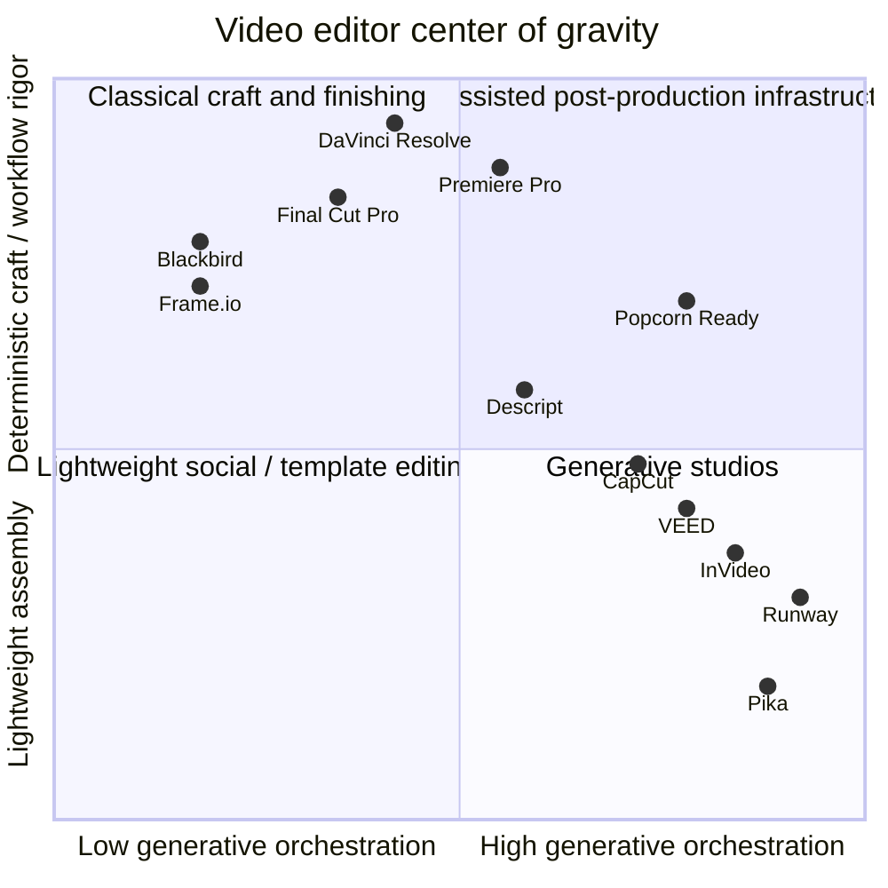

# Video Editor Feature Positioning

This matrix adapts the feature heatmap from
[`video-editing-market-landscape.md`](./video-editing-market-landscape.md) and
adds Popcorn Ready as the first row. It is intended for product
positioning and roadmap discussion, not as a formal benchmark.

Legend: `●●●` strong, `●●○` medium, `●○○` light, `○○○` minimal or not primary.

## Feature Matrix

| App | Deep timeline craft | Audio post | Compositing / VFX | Captions / localization | Generative AI | Collaboration / versioning | Positioning read |
|---|---:|---:|---:|---:|---:|---:|---|
| **Popcorn Ready** | ●●○ | ●○○ | ●○○ | ●○○ | ●●● | ●●○ | Differentiates as a deterministic, prompt-to-timeline assembly layer that can route generation providers while keeping exports inspectable. Not trying to replace pro NLE finishing. |
| Premiere Pro | ●●● | ●●○ | ●●○ | ●●● | ●●○ | ●●○ | Broad pro craft stack with strong Adobe ecosystem and Firefly integration. |
| Final Cut Pro | ●●● | ●●○ | ●●○ | ●●○ | ●○○ | ●○○ | Mac-native pro editor with fast deterministic craft workflows. |
| DaVinci Resolve | ●●● | ●●● | ●●● | ●●○ | ●○○ | ●●● | Deepest all-in-one craft, color, audio, VFX, and collaboration stack. |
| Avid Media Composer | ●●● | ●●○ | ●○○ | ●●○ | ●○○ | ●●○ | Scripted/enterprise editorial system of record. |
| CapCut | ●●○ | ●○○ | ●○○ | ●●● | ●●● | ●●○ | Social-first editor with strong creator AI and fast mobile/web workflows. |
| LumaFusion | ●●○ | ●●○ | ●●○ | ●○○ | ●○○ | ●○○ | Mobile-first prosumer timeline depth. |
| Clipchamp | ●○○ | ●○○ | ○○○ | ●●○ | ●○○ | ●○○ | Simple browser editor for casual and Microsoft 365 users. |
| Canva Video | ●○○ | ○○○ | ○○○ | ●●○ | ●●○ | ●●○ | Design/template-first marketing video workflow. |
| VEED | ●○○ | ●○○ | ○○○ | ●●● | ●●● | ●●○ | Web editing shell with strong captions, dubbing, and model-brokerage AI. |
| WeVideo | ●○○ | ●○○ | ●○○ | ●●○ | ●○○ | ●●● | Lightweight collaborative editor for education and business teams. |
| Descript | ●●○ | ●●○ | ●○○ | ●●● | ●●○ | ●●○ | Transcript-native editing for podcasts, explainers, and repurposing. |
| InVideo | ●○○ | ●○○ | ○○○ | ●●○ | ●●● | ●●○ | Prompt/template workflow with broad external model access. |
| Pictory | ●○○ | ●○○ | ○○○ | ●●○ | ●●○ | ●●○ | Text, URL, webinar, and training repurposing workflow. |
| Runway | ●○○ | ○○○ | ●●○ | ○○○ | ●●● | ●○○ | Native generative video studio for shot invention and manipulation. |
| Synthesia | ○○○ | ○○○ | ○○○ | ●○○ | ●●● | ●●○ | Avatar/business video generation for training and internal comms. |
| Pika | ○○○ | ○○○ | ●○○ | ○○○ | ●●● | ●○○ | Generative clip experimentation and effects. |
| Frame.io | ○○○ | ○○○ | ○○○ | ●○○ | ○○○ | ●●● | Review, versioning, and media workflow backbone rather than an editor. |
| Blackbird | ●●○ | ●○○ | ●○○ | ●○○ | ○○○ | ●●● | Browser-native enterprise workflow editor for live, news, and sports. |

## Strategic Feature Map

This chart places products by center of gravity. The useful opening for Popcorn
Ready is the upper-right region: high AI orchestration while preserving a
deterministic, inspectable timeline and export path.

## How Popcorn Ready Differentiates

Popcorn Ready should not be positioned as another timeline NLE or another pure
text-to-video generator. The sharper position is:

1. **Prompt to structured plan to deterministic timeline.** The AI plans and
   patches structured data; rendering remains inspectable.
2. **Generation orchestration, not model lock-in.** The product can route image,
   video, voice, and future localization providers behind one workflow.
3. **Local-first provenance today, cloud provenance later.** The current local
   export/gallery model is a pragmatic starting point for later S3-backed
   project history, rights, approvals, and version tracking.
4. **Useful middle layer.** It sits between pro NLE rigor, generative video
   studios, and review/versioning systems instead of trying to replace all of
   them at once.
